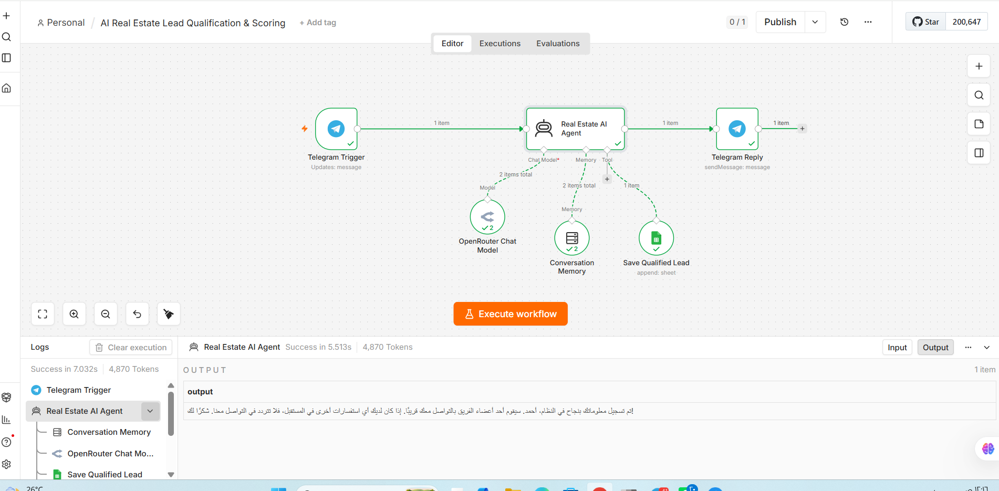

# AI Real Estate Lead Qualification & Scoring

An n8n AI automation that qualifies real-estate leads through Telegram, maintains conversation memory, calculates an internal lead score, and saves high-quality leads to Google Sheets.
## 🔄 Workflow

## Workflow

Telegram Trigger
→ Real Estate AI Agent
→ Telegram Reply

The AI Agent uses:
- OpenRouter Chat Model
- Conversation Memory
- Google Sheets Tool: Save Qualified Lead

## What it does

1. Receives a customer message through Telegram.
2. Conducts a natural conversation in the customer's language.
3. Collects real-estate lead information such as:
   - Name
   - Email
   - Phone
   - Property type
   - Transaction type
   - Property status
   - First purchase
   - Timeline
   - Budget
   - Decision maker
   - Previous purchase
   - Payment method
4. Asks the customer to confirm the collected information.
5. Calculates an internal score from 0–100.
6. Classifies the lead as High, Medium, or Low.
7. For a score of 80+, calls the Google Sheets tool and stores the qualified lead.
8. Replies to the customer through Telegram.

## Technologies

- n8n
- Telegram
- OpenRouter
- AI Agent
- Conversation Memory
- Google Sheets

## Import

1. Download the JSON workflow.
2. Open your n8n workspace.
3. Import the workflow JSON.
4. Create/select your own credentials for:
   - Telegram
   - OpenRouter
   - Google Sheets
5. Select your own Google Sheet.
6. Review the AI Agent prompt and scoring rules.
7. Test the workflow before activating it.

## Important

This repository contains a sanitized workflow export for portfolio/learning purposes.

Do not publish:
- Telegram bot tokens
- OpenRouter API keys
- Google OAuth tokens
- Private spreadsheet data
- Private customer data

The workflow JSON in this repository has account-specific credentials and identifiers removed/replaced.
